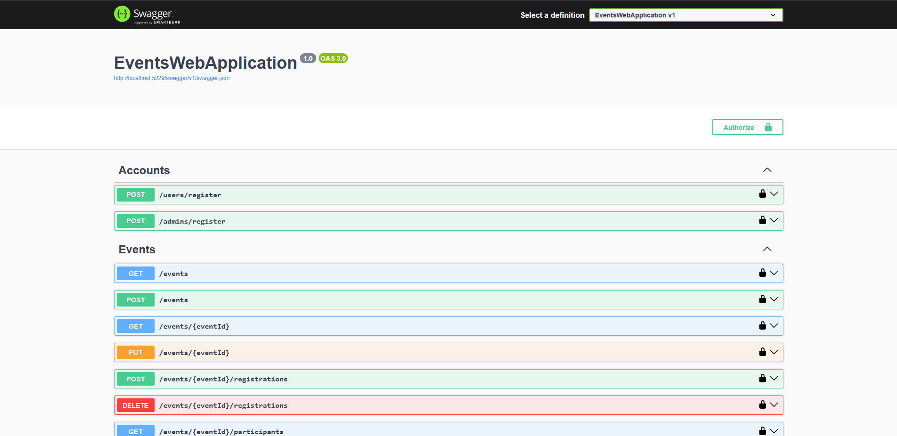

# EventsWebApplication

### Requirements

This project is built using .Net 9. You need to have .Net 9 SDK installed to run or modify this project.
This project also uses PostgreSQL, so You will need to have either PostgreSQL 17 or Docker (with Docker Compose) installed.

### How to run

First You will need git-clone the project:
```bash
git clone https://github.com/Lempapo/EventsWebApplication.git
```

Restore all dependencies:
```bash
dotnet restore
dotnet tool restore
```

Now You need to run the database. By default, application expects the DB to be run on port `5230`, DB name, username and password all should be `postgres`. 
If You don't have PostgreSQL installed, then You can launch it via the docker compose configuration:
```bash
docker-compose up
```

Then You need to apply all the migrations:
```bash
dotnet ef database update --project ./EventsWebApplication
```

And finally, launch the application:
```bash
dotnet run --project ./EventsWebApplication
```

Navigate to the http://localhost:5229/swagger/index.html.

### How to use

Here is a short clip, showcasing how to use main application features:

[](https://youtu.be/5bYJDRMldto)